# Deploying a Static Website on Amazon S3

## Introduction

This project demonstrates how to host a static website on **Amazon S3**.  
The site is called **MycoHarvest**, a demo mushroom farm brand.

We will:

- Build a multi-page website (HTML, CSS, images).  
- Host it on an **S3 bucket** with static website hosting enabled.  
- Configure bucket policy for **public access**.  
- Access the site via the generated **S3 Website Endpoint URL**.  

---

## Architecture

The solution follows a simple AWS architecture:

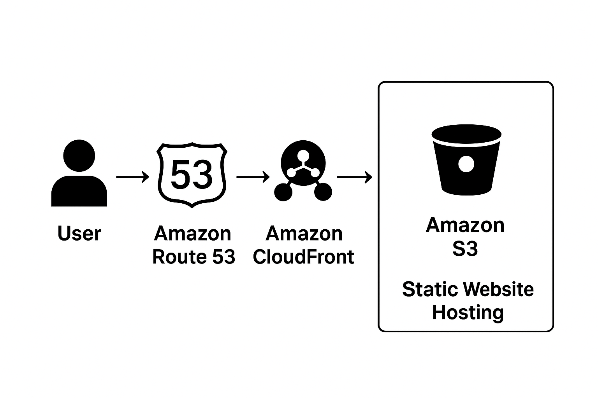 <!-- Add your architecture screenshot here -->
## (Optional extensions:)

- Amazon CloudFront for global content delivery and HTTPS.  
- Amazon Route 53 for custom domain names.  

---

```bash
/MycoHarvest-Website
├── index.html        # Homepage
├── about.html        # About page
├── products.html     # Products page
├── contact.html      # Contact page
├── style.css         # Styling
├── /images           # Mushroom/product images
└── README.md         # Documentation
```
### My VS Code Project Structure

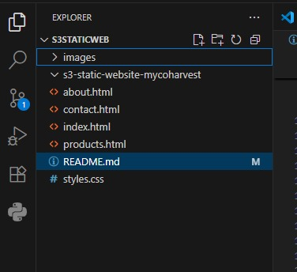

---

## Steps to Deploy Website on S3

### 1️⃣ Create an S3 Bucket
- Go to **AWS Console → S3 → Create bucket**. 

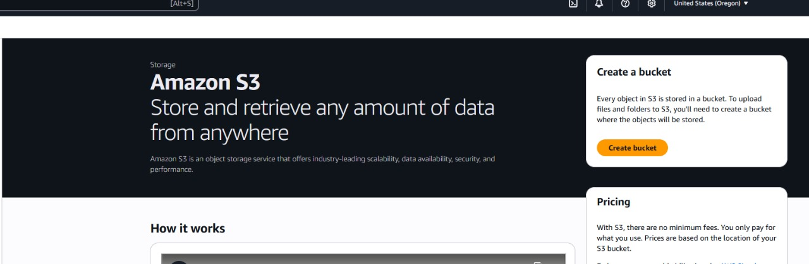 

- Choose a unique bucket name (e.g., `mycoharveststaticweb`).  

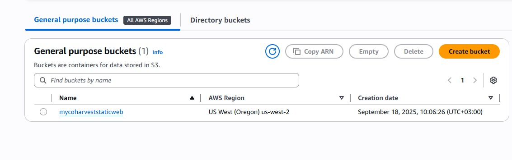

- Select region (e.g., `us-west-2`).  
- Uncheck **Block all public access**.  

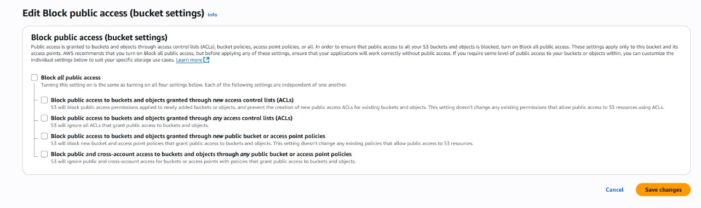

---

### 2️⃣ Upload Website Files
- Open your bucket → **Upload** → add `index.html`, other pages, CSS, and images. 

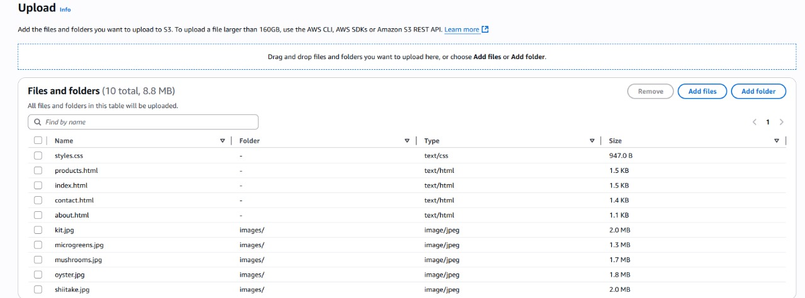

---

### 3️⃣ Enable Static Website Hosting
- Go to **Properties → Static website hosting**.  
- Select **Enable**.  
- Choose **Host a static website**.  

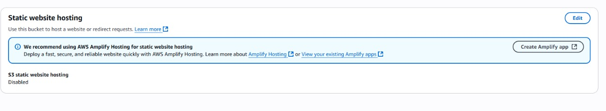

- Enter:  
  - **Index document:** `index.html`  
  - **Error document:** `error.html` (optional) 

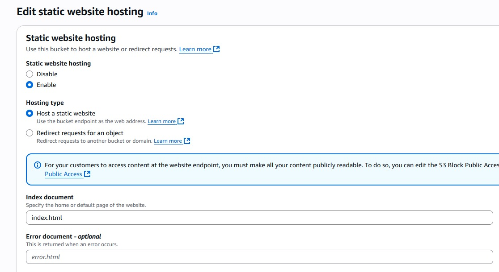  

---

### 4️⃣ Configure Bucket Policy (Public Read)
- Go to **Permissions → Bucket policy** and add:  

```json
{
  "Version": "2012-10-17",
  "Statement": [
    {
      "Sid": "PublicReadGetObject",
      "Effect": "Allow",
      "Principal": "*",
      "Action": "s3:GetObject",
      "Resource": "arn:aws:s3:::mycoharveststaticweb/*"
    }
  ]
}
```
### Bucket policy editor

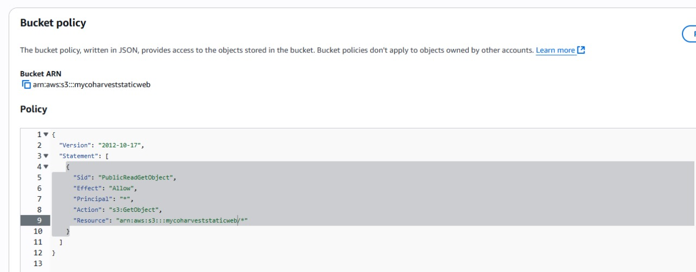

---

## Testing Pages

- **Home Page** → Welcome message and featured products. 

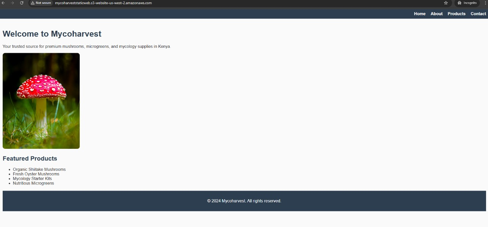

- **About Page** → Details about the farm/business.  

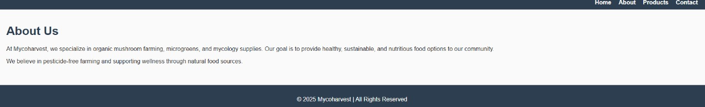

- **Products Page** → Product images and list. 

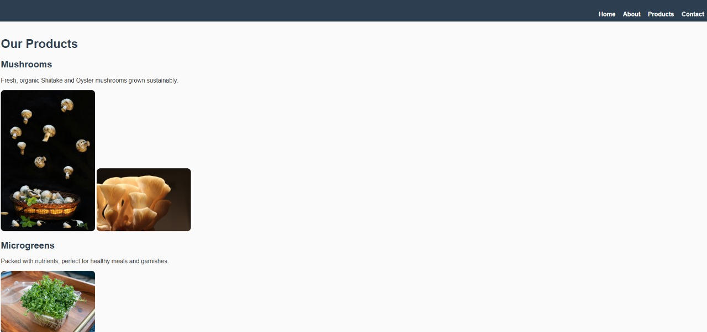

- **Contact Page** → Contact details / form.

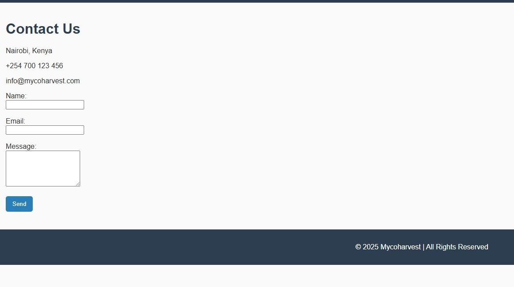

---

## Enhancements

- Add **CloudFront** for CDN + HTTPS.  
- Add **Route 53** for custom domain.  
- Automate deployment using **AWS CLI** or **Terraform**.  

---

## Conclusion

This project demonstrates how easy it is to deploy and serve static websites using **Amazon S3**.  
It’s a cost-effective, highly available solution suitable for **portfolios, blogs, landing pages, and documentation sites**.  

---

## Screenshots Index  <!--NB: I added this section just for fun -->

To make it easier to follow, here’s the recommended screenshot flow:

1. Project structure in VS Code.  
2. Bucket creation page.  
3. Files uploaded into S3 bucket.  
4. Static website hosting settings.  
5. Bucket policy editor.  
6. Website endpoint URL in bucket properties.  
7. Live homepage in browser.  
8. About page.  
9. Products page.  
10. Contact page. 

---

## Author
**Belinda Ntinyari** – [GitHub](https://github.com/Bel-94) | [LinkedIn](https://www.linkedin.com/in/belinda-ntinyari/)

---

## License
This project is licensed under the [MIT License](https://opensource.org/licenses/MIT).
