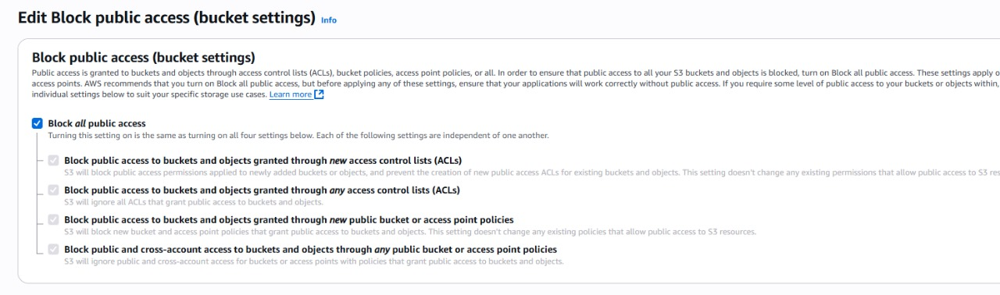

# Deploying a Static Website on Amazon S3

## Introduction

This project demonstrates how to host a static website on **Amazon S3**.  
The site is called **MycoHarvest**, a demo mushroom farm brand.

We will:

- Build a multi-page website (HTML, CSS, images).  
- Host it on an **S3 bucket** with static website hosting enabled.  
- Configure bucket policy for **public access**.  
- Access the site via the generated **S3 Website Endpoint URL**.  

---

## Architecture

The solution follows a simple AWS architecture:

 <!-- Add your architecture screenshot here -->
## (Optional extensions:)

- Amazon CloudFront for global content delivery and HTTPS.  
- Amazon Route 53 for custom domain names.  

---

```bash
/MycoHarvest-Website
├── index.html        # Homepage
├── about.html        # About page
├── products.html     # Products page
├── contact.html      # Contact page
├── style.css         # Styling
├── /images           # Mushroom/product images
└── README.md         # Documentation
```
### My VS Code Project Structure


---

## Steps to Deploy Website on S3

### 1️⃣ Create an S3 Bucket
- Go to **AWS Console → S3 → Create bucket**. 
 

- Choose a unique bucket name (e.g., `mycoharveststaticweb`).  


- Select region (e.g., `us-west-2`).  
- Uncheck **Block all public access**.  


---
